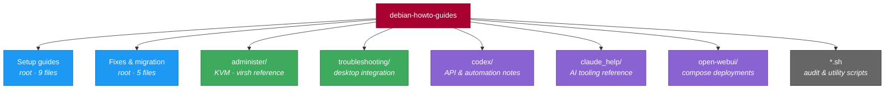

# Debian HOWTO Guides

> **Field notes from a Linux workstation that actually gets used.**
> Twenty-five runbooks covering Debian, MX Linux, KDE/XFCE, virtualization, and the AI tooling that sits on top of them — each one written *after* the problem was solved, with the exact commands that worked.


---

## Table of Contents

- [What this is](#what-this-is)
- [Who it's for](#who-its-for)
- [Repository map](#repository-map)
- [The guides](#the-guides)
  - [Setup and installation](#setup-and-installation)
  - [Desktop and migration](#desktop-and-migration)
  - [Troubleshooting and fixes](#troubleshooting-and-fixes)
  - [Administration reference](#administration-reference)
  - [AI and integration notes](#ai-and-integration-notes)
- [Scripts](#scripts)
- [Deployments](#deployments)
- [How to use these guides](#how-to-use-these-guides)
- [Conventions](#conventions)
- [Tested environments](#tested-environments)
- [Contributing](#contributing)
- [Tags](#tags)
- [License](#license)

---

## What this is

A personal operations library, made public. Every document here exists because something broke, or something needed installing, and the fix took long enough to be worth writing down.

The organizing principle is **solve once, write it down**. These are not tutorials aimed at beginners and not vendor documentation. They are the notes you would want if you hit the same wall next year on a fresh install — exact package names, exact error strings, exact version context.

The `codex/` subdirectory states the same charter in its own words:

> CODEX captures implementation-grade integration procedures so that solved problems do not need to be re-solved.

That sentence covers the whole repository.

### What makes these different

| Most documentation | These guides |
| :--- | :--- |
| Written before the problem | Written after the fix, from a real terminal |
| Generic across distros | Pinned to a distro *and* release |
| Happy path only | Failure modes, error strings, and rollbacks included |
| "Install the driver" | `sudo apt install --yes remmina remmina-plugin-rdp` |
| Assumes it worked | Includes the verification step |

---

## Who it's for

- **Sysadmins** setting up a new Debian or MX Linux workstation and wanting the annoyances gone in ten minutes.
- **Anyone migrating desktops** — the XFCE → KDE Plasma 6 guide is a 29 KB blow-by-blow of a real migration, not a summary.
- **People who hit the same specific bug** — Chrome freezing on AMD Polaris, Dolphin refusing SFTP, the keyring prompting twice at login. If you searched that error and landed here, jump straight to the file.
- **Integrators** who need to know how an API behaves in practice rather than how the docs claim it behaves.

> [!NOTE]
> This is a *reference* repository, not a software project. There is nothing to build, install, or run — except two standalone scripts, [documented below](#scripts).

---

## Repository map



<details>
<summary><b>Full directory tree</b> — click to expand</summary>

```text
debian-howto-guides/
├── README.md                                  ← you are here
│
├── mx25-first-10-minutes.md                   Post-install housekeeping
├── debian-docker-setup-guide.md               Docker CE + systemd
├── debian-nvidia-setup-guide.md               NVIDIA proprietary driver
├── debian-python3-setup-guide.md              venv / pipx / poetry under PEP 668
├── debian-remmina-setup-guide.md              RDP client
├── debian-tmux-motd-setup-guide.md            tmux session manager + MOTD
├── debian-virtman-setup-guide.md              KVM/QEMU + virt-manager
├── debian-xrdp-setup-guide.md                 XRDP remote desktop server
├── falcon-sensor-deploy-linux.md              CrowdStrike Falcon sensor
│
├── kde-plasma-migration-guide.md              XFCE → KDE Plasma 6
├── chrome-gpu-amd-freeze.md                   Chrome hangs on AMD Polaris
├── debian-kde-dolphin-xfce.md                 Dolphin SFTP "Invalid protocol"
├── multi-keyring-prompt-fix.md                Login keyring auto-unlock
├── linux-troubleshooting-guide.md             Diagnostic methodology (AI prompt)
│
├── administer/
│   └── virsh-reference-guide.md               Complete virsh command reference
│
├── troubleshooting/
│   └── kde-dolphin-xfce-file-association.md   Open With / menu file mismatch
│
├── codex/                                     [AGPL-3.0]
│   ├── README.md                              Charter and scope
│   ├── browser-automation-guide.md            Console automation field guide
│   ├── scorm-auto-advance.md                  SCORM timer-gate automation
│   └── telegram.md                            Telegram bot + n8n workflows
│
├── claude_help/
│   ├── README.md
│   ├── CLAUDE.md                              Terse-response behavior config
│   ├── claude-complete-guide.md               Full capabilities reference
│   └── claude-efficiency-checklist.md         Token/time efficiency checklist
│
├── open-webui/
│   ├── README.md                              Setup + troubleshooting + usage
│   ├── docker-compose.yaml                    CPU / host-network stack
│   └── docker-compose-cuda.yaml               NVIDIA GPU stack
│
├── kde-audit.sh                               KDE/Plasma package completeness audit
└── brightness_set_max.sh                      Force backlight to maximum
```

Two directories, `review/` and `reviewed/`, are used as a local triage workflow and are
excluded via `.gitignore`. They are intentionally absent from the tree above.

</details>

---

## The guides

### Setup and installation

Green-field procedures. Run top to bottom on a fresh system.

| Guide | Covers | Target | Size |
| :--- | :--- | :--- | ---: |
| [`mx25-first-10-minutes.md`](mx25-first-10-minutes.md) | Post-install housekeeping — kill the annoyances, install essentials, enable backports | MX 25 · Xfce · amd64 | 16 § |
| [`debian-docker-setup-guide.md`](debian-docker-setup-guide.md) | Docker installation on a systemd MX 25 | MX 25 (Trixie) | 10 § |
| [`debian-nvidia-setup-guide.md`](debian-nvidia-setup-guide.md) | GPU identification through official driver install | MX 25 | 24 § |
| [`debian-python3-setup-guide.md`](debian-python3-setup-guide.md) | `venv`, `pipx`, `poetry` — and the four things that break system Python | MX Trixie (Debian 13) | 35 § |
| [`debian-remmina-setup-guide.md`](debian-remmina-setup-guide.md) | Remmina RDP client, with plugin | MX Trixie | 27 § |
| [`debian-tmux-motd-setup-guide.md`](debian-tmux-motd-setup-guide.md) | tmux session manager plus a custom MOTD, in four copy-paste blocks | Debian / Ubuntu | 20 § |
| [`debian-virtman-setup-guide.md`](debian-virtman-setup-guide.md) | KVM/QEMU virtualization with virt-manager | MX Trixie · systemd | 19 § |
| [`debian-xrdp-setup-guide.md`](debian-xrdp-setup-guide.md) | XRDP server: install, config, firewall, audio, clipboard, multi-session | MX Linux · XFCE | 73 § |
| [`falcon-sensor-deploy-linux.md`](falcon-sensor-deploy-linux.md) | CrowdStrike Falcon: install, `.env` config, verify, troubleshoot, clean uninstall | Debian/Ubuntu · systemd | 38 § |

> [!TIP]
> New machine? The intended order is **`mx25-first-10-minutes`** → then whichever of the above you actually need. It clears the defaults that make every later step noisier.

### Desktop and migration

| Guide | What it documents | Size |
| :--- | :--- | ---: |
| [`kde-plasma-migration-guide.md`](kde-plasma-migration-guide.md) | A complete XFCE → **KDE Plasma 6.3.x** migration on MX 25 / Trixie, recorded as it happened (2026-03-31). Status: complete, fully functional. | 41 § |
| [`debian-kde-dolphin-xfce.md`](debian-kde-dolphin-xfce.md) | Running Dolphin under XFCE — SFTP remote access and the fix for `Invalid protocol` when SSH works fine from the shell. | 14 § |

### Troubleshooting and fixes

Each of these is scoped to one specific, reproducible failure.

<details open>
<summary><b>Symptom → guide</b></summary>

| If you're seeing… | Read |
| :--- | :--- |
| Chrome freezing / hanging on an AMD Polaris or RX 550 GPU | [`chrome-gpu-amd-freeze.md`](chrome-gpu-amd-freeze.md) |
| Dolphin: `Invalid protocol` on an `sftp://` URL | [`debian-kde-dolphin-xfce.md`](debian-kde-dolphin-xfce.md) |
| Dolphin **Open With** list empty, or file associations forgotten under XFCE | [`troubleshooting/kde-dolphin-xfce-file-association.md`](troubleshooting/kde-dolphin-xfce-file-association.md) |
| A second keyring password prompt after you already logged in | [`multi-keyring-prompt-fix.md`](multi-keyring-prompt-fix.md) |
| Something else, and you need a method rather than an answer | [`linux-troubleshooting-guide.md`](linux-troubleshooting-guide.md) |

</details>

> [!IMPORTANT]
> `linux-troubleshooting-guide.md` is **not** a howto. It is a system prompt — a set of project instructions defining a Linux troubleshooting persona, built around *diagnose before prescribing* and *explain the why*. Useful as a diagnostic checklist for a human too, but that's its purpose.

### Administration reference

| Guide | Scope | Size |
| :--- | :--- | ---: |
| [`administer/virsh-reference-guide.md`](administer/virsh-reference-guide.md) | Complete `virsh` command reference for daily KVM/QEMU operations. Written against RHEL / Rocky Linux conventions — the commands carry over to Debian KVM, the package names do not. | 58 § |

### AI and integration notes

The second half of this repository: notes on tooling that sits *above* the OS.

<details>
<summary><b><code>codex/</code></b> — applied service integration <i>(4 documents · AGPL-3.0)</i></summary>

Preserves operational knowledge that required investigation, debugging, or reverse-engineering to obtain. Answers questions of the form: *how is this API actually called in practice, what breaks in real deployments, which credentials and headers are required, and what do the error patterns look like.*

| Document | Subject |
| :--- | :--- |
| [`codex/README.md`](codex/README.md) | Charter, scope, and contribution standard |
| [`codex/browser-automation-guide.md`](codex/browser-automation-guide.md) | Automating timer-gated, click-heavy web interfaces with nothing but <kbd>F12</kbd> and JavaScript. Born from rage-automating an OSHA 10 course.[^osha] |
| [`codex/scorm-auto-advance.md`](codex/scorm-auto-advance.md) | Concrete SCORM player case: read the countdown, wait, click the enabled nav button, repeat. Quiz slides still need a human. |
| [`codex/telegram.md`](codex/telegram.md) | Telegram bot integration for n8n workflows — zero to working alerts. |

</details>

<details>
<summary><b><code>claude_help/</code></b> — Claude Code reference <i>(4 documents)</i></summary>

| Document | Subject |
| :--- | :--- |
| [`claude_help/claude-complete-guide.md`](claude_help/claude-complete-guide.md) | Full capabilities guide with a practical example for every feature (31 KB, 61 sections) |
| [`claude_help/claude-efficiency-checklist.md`](claude_help/claude-efficiency-checklist.md) | Short checklist for using the tool without wasting turns |
| [`claude_help/CLAUDE.md`](claude_help/CLAUDE.md) | A three-line behavior config: respond concisely, don't write docs unprompted, don't over-explain simple edits |
| [`claude_help/README.md`](claude_help/README.md) | Directory intro |

</details>

---

## Scripts

Two standalone Bash utilities. Both are short enough to read before you run them — **please do.**

<details>
<summary><b><code>kde-audit.sh</code></b> — KDE/Plasma completeness audit</summary>

Checks whether a Debian Trixie system has a complete KF6 / Plasma 6 installation, group by group, using **Trixie package names** rather than generic upstream ones. Reports installed vs. missing per group via `dpkg -l`.

```bash
bash kde-audit.sh
```

- Read-only — queries `dpkg`, installs nothing.
- No root required.
- Pairs with [`kde-plasma-migration-guide.md`](kde-plasma-migration-guide.md): run it after the migration to find what the metapackages missed.

</details>

<details>
<summary><b><code>brightness_set_max.sh</code></b> — force backlight to maximum</summary>

Finds the first controller under `/sys/class/backlight`, reads its `max_brightness`, and writes that value to `brightness`.

```bash
sudo ./brightness_set_max.sh
```

> [!WARNING]
> **Requires root** — it exits immediately if `$EUID` is not 0, because it writes directly to `sysfs`. It also takes the *first* controller found; a machine with more than one backlight device may not get the one you meant.

Intended to be wrapped in a systemd unit so the panel comes up at full brightness after resume or boot.

</details>

---

## Deployments

<details>
<summary><b><code>open-webui/</code></b> — Open WebUI + Ollama via Docker Compose</summary>

A quick setup guide, reference manual, and troubleshooting resource in one — [`open-webui/README.md`](open-webui/README.md) (19 sections).

| File | Stack |
| :--- | :--- |
| [`docker-compose.yaml`](open-webui/docker-compose.yaml) | Open WebUI + Ollama, host networking, WebUI on port `3000` → container `8080` |
| [`docker-compose-cuda.yaml`](open-webui/docker-compose-cuda.yaml) | Same stack with NVIDIA GPU passthrough |

```bash
cd open-webui
docker compose up -d          # CPU
docker compose -f docker-compose-cuda.yaml up -d   # NVIDIA
```

Prerequisite: Docker, per [`debian-docker-setup-guide.md`](debian-docker-setup-guide.md). For the CUDA variant, also [`debian-nvidia-setup-guide.md`](debian-nvidia-setup-guide.md).

</details>

---

## How to use these guides

1. **Check the version line first.** Every guide names the release it was tested on. Debian point releases move; a guide written for Trixie may not apply cleanly to Bookworm.
2. **Read the whole document before running anything.** Several guides have a rollback or verification step that only makes sense if you knew it was coming.
3. **Copy commands, don't retype them.** Package names here are deliberately exact — `remmina-plugin-rdp`, not "the RDP plugin."
4. **Back up before config edits.** The guides that touch `/etc` say so; the habit is worth having anyway.

```bash
# The pattern used throughout — timestamped backup before editing
sudo cp /etc/apt/sources.list.d/debian.sources \
        /etc/apt/sources.list.d/debian.sources.bak.$(date +%Y%m%d)
```

> [!CAUTION]
> These are notes from one person's machines. They are accurate to the systems they were written on and nothing more. Nothing here is vendor-supported. Read before running, especially anything prefixed with `sudo`.

---

## Conventions

Consistent across the collection:

- [x] Fenced code blocks are tagged with a language — ```` ```bash ````, ```` ```yaml ````, ```` ```ini ````
- [x] Guides open with a version/scope line naming the tested distro and release
- [x] Commands use `--yes` where a prompt would otherwise stall a copy-paste block
- [x] Longer guides are split into numbered phases or steps
- [x] Failure modes and their fixes live in the same file as the procedure
- [ ] Cross-links between related guides — *sparse today; see [Contributing](#contributing)*
- [ ] A per-guide "last verified" date — *only some guides carry one*

Roughly two thirds of the collection is explanatory prose and one quarter is troubleshooting material — the ratio you'd expect from documents written in the aftermath of a problem rather than in advance of one.

---

## Tested environments

| Distribution | Base | Where it appears |
| :--- | :--- | :--- |
| **MX Linux 25 "Infinity"** | Debian 13 (Trixie) | Most guides — the primary platform |
| **MX Linux 23** | Debian 12 (Bookworm) | Chrome / AMD Polaris fix |
| **Debian / Ubuntu** *(generic)* | — | tmux + MOTD, Falcon sensor |
| **RHEL / Rocky Linux** | — | virsh reference |

Architecture is `amd64` throughout. Init is `systemd` unless a guide says otherwise — relevant on MX, which ships both.

Desktops covered: **XFCE**, **KDE Plasma 6.3.x**, and the awkward seam between them, which turns out to be where a surprising number of these bugs live.

---

## Contributing

Personal notes, but corrections are welcome — especially "this broke on release *X*."

**Good additions look like:**

- A guide that names its tested distro *and* release in the first five lines
- Exact commands and exact error strings, copied from a real terminal, not paraphrased
- The verification step, not just the fix
- Failure modes documented alongside the happy path

**Known gaps, if you want somewhere to start:**

| Gap | Detail |
| :--- | :--- |
| Cross-linking | The guides are near-fully independent — almost no document links to another. Related-guide links would help a lot. |
| Heading anchors | A handful of in-page `#anchor` links don't resolve, mostly in `debian-xrdp-setup-guide.md`, where emoji headings and plain-text anchors disagree. |
| Verification dates | Only some guides say when they were last confirmed working. |

---

## Tags

**Topics:** `debian` · `mx-linux` · `linux` · `sysadmin` · `documentation` · `howto` · `runbook` ·
`trixie` · `kde` · `plasma6` · `xfce` · `xrdp` · `remote-desktop` · `kvm` · `qemu` · `virsh` ·
`libvirt` · `docker` · `docker-compose` · `nvidia` · `amd-gpu` · `python` · `tmux` · `bash` ·
`troubleshooting` · `crowdstrike` · `ollama` · `open-webui` · `n8n` · `telegram-bot` ·
`browser-automation` · `claude-code`

<details>
<summary>Copy-paste list for GitHub repository topics</summary>

```text
debian mx-linux linux sysadmin documentation howto runbook trixie kde plasma6
xfce xrdp remote-desktop kvm qemu virsh libvirt docker docker-compose nvidia
amd-gpu python tmux bash troubleshooting crowdstrike ollama open-webui n8n
telegram-bot browser-automation claude-code
```

</details>

---

## License

> [!NOTE]
> The repository root carries **no license file**. The `codex/` subdirectory is licensed **GNU AGPL-3.0** ([`codex/LICENSE`](codex/LICENSE)) — it was an independent repository before being consolidated here, and that license travels with it.
>
> If you intend to reuse material from outside `codex/`, ask first.

---

<div align="center">

**Solve once. Write it down.**

<sub>Documentation only — no warranty, no vendor support. Read before you run.</sub>

</div>

[^osha]: A SCORM-based course player that forces you to stare at a countdown timer, then click "Next" — for *hours*. The guide generalizes to any timer-gated, slide-based, click-to-advance web interface: compliance training, onboarding modules, corporate LMS.
